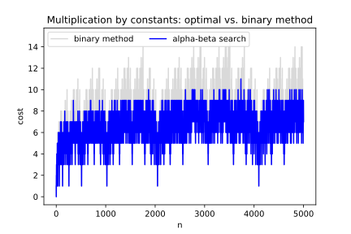

<!-- markdown-toc start - Don't edit this section. Run M-x markdown-toc-refresh-toc -->
**Table of Contents**

- [Introduction](#introduction)
- [As a library and command-line utility](#as-a-library-and-command-line-utility)
    - [As a library](#as-a-library)
    - [As a command-line utility](#as-a-command-line-utility)
- [Instruction Tables](#instruction-tables)
- [Data Analysis](#data-analysis)
- [References](#references)

<!-- markdown-toc end -->

# Introduction

This repository serves several purposes:

* As a library and command for getting sequences of instructions to perform integer multiplications
* As a place to store optimal instruction-sequence tables, and
* for data analysis

We drill into each of these below.

# As a library and command-line utility

The code is being more actively developed in Python at first, although there is some older C code that we will update and build.
The python code is in [_spe_](../spe86) and the C code is in [_spe_](../spe86), [_vinc17/rigo_](./vinc17/rigo).

## As a library

First, we have code to compute the mininum number of _shifts_, _adds_, _subtracts_, to multiply a number by a constant integer under different cost models.
The code is being more actively developed in Python at first but there is some older C code that we will update and build.

The intention in coding is to be a bit flexible to allow for variation in machine architectures. In particular we allow for architectures that have a shift time that varies with the amount to be shifted. And we can handle architectures that don't have a "subtract" operation.

Given this, we can handle, for example, a machine with only the `add` operation, disallowing the `subtract` operation and using a custom shift cost function that varies by the amount shifted. Note: `y = x << 1` is the same as `y = x + x`, and `y = x << 2` would be the same thing as `z = x + x; y = z + z`.

This code can be use as a library inside a compiler that wants generate efficient sequences of code for multiplication, since searching is pretty fast for smaller numbers: around 0.1 second for numbers under 5 digits. Note that as as numbers get larger the programs slows down combinatorially. For 10 digits, running time is about 5 seconds. But see below.

## As a command-line utility

Of course, there may be need to use this outside of a Python library, so we have wrapped that to a command-line program `mult-by-const`. This may be especially useful if you just need compute a single value or a small number of values, possibly using a custom cost model.

The command-line program also allows for the internal cache values to be dumped and loaded in JSON, and YAML, and CSV formats. So for really large numbers you can start a computation, save the cache and then at some time later resume the search.

Finally the command-line programs allows you to iterate up to some value, starting from scratch or starting from a previously-computed table. And this leads into the next purpose...

# Instruction Tables

Instead of using our code to search for sequences, you can use tables that have been previously generatated. This is again suitable for use inside a compiler, or perhaps a general-purpose multiplication routine, which does a table lookup for "small" values. For larger ones a general-purpose routines can use this as a base table from which to do the standard multiplcation algorithm. For example, people learning multiplication learn by rote the multiplication table for pairs of numbers from 0 to 10.

Initially we built the tables using code here. If you find a way to improve entires in the table, please send them along an it will be incorporated into the table.

And having tables also allows us to improve sequences going in the other direction. Rather than start with a number and searching for a sequence as output, we can start with a table
and look numbers that will probably have short sequences and improve the table. We intend to write code for this as well.

The current set of tables we have can be found in [_tables_](./tables).

# Data Analysis

Having the tables in hand, we can then start analyzing how the optimum sequence grows with the value of a number. For example looking at the graph given above and just the blue portion, we find that on average multiplication by a number grows logarithmically about 1/2 an instruction for every power of 1,000. For numbers in the 4,000-5,000 range, the average is about 7 instructions. Also the number seems to constantly fluctuate, in the range betwon 500-1400 the fluctuation is two instructions, while in the 4,500-5000 range it is three instructions. For optimum number of instructions the between any two consecutive numbers, the the difference should vary by at most one instruction.

I should note that the table above assumes, that "add", "shift", and "subtact" operations are available and that each instruction takes the same amount of time to execute. Also, the sequences ar limited to using no more than three registers total, a register for the initial value which is unchanged, a register for the current product, and a register that is sometimes used to store the product before the last one. Using more registers will reduce the number of instructions needed.

Graphs are stored in [_graphs_](./graphs).

# References

* My _Software: Practice and Experience_ paper [Multiplication by integer constants](https://onlinelibrary.wiley.com/doi/pdf/10.1002/spe.4380160704) for details.
* Section 8-4 of Henry Warren's: Hacker's Delight (ISBN-13: 978-0321842688) has some updates and revisions.
* _The Art Computer Programming_, Vol 2, 2nd Edition; Section 4.6.3, page 441 of the 2nd Edition
* Vincent Lefèvre's [Multiplication by Integer Constant site](http://www.vinc17.net/research/mulbyconst/index.en.html)
* Yevgen Voronenko and Markus Püschel's [Spiral Multiplier Block Generator site](http://spiral.ece.cmu.edu/mcm/gen.html)
