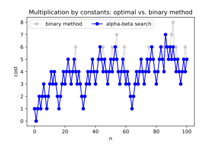

[](https://travis-ci.org/rocky/mult-by-constants)

<!-- markdown-toc start - Don't edit this section. Run M-x markdown-toc-refresh-toc -->
**Table of Contents**

- [Synopsis](#synopsis)
- [Introduction](#introduction)
    - [As a library](#as-a-library)
    - [As a command-line utility](#as-a-command-line-utility)
    - [Tools for generating graphs and doing data analysis](#tools-for-generating-graphs-and-doing-data-analysis)
- [Examples](#examples)
    - [Instruction Sequences](#instruction-sequences)
    - [Alpha-beta pruning](#alpha-beta-pruning)
    - [Cache entries](#cache-entries)
    - [Dumping Data](#dumping-data)

<!-- markdown-toc end -->


Synopsis
========

Python API:

```python
from mult_by_const import MultConst, load_yaml, dump, dump_csv, print_instructions

# Figure out a multiplication sequence for n
mconst = MultConst(debug=True)
cost, instrs = mconst.find_mult_sequence(n)
print_instructions(instrs, n, cost)

table_path = "tables/10000-stdcost.txt"
with open(table_path) as in:
	mcache = load_yaml(in)       # Read in YAML table
dump(mcache)                     # Display table

out_path = "tables/10000-stdcost.csv"
with open(out_path, "w") as out:
    dump_csv(mcache)             # Output as CSV for data analysis
```

See also the [_spe86_](./spe86) directory for a C API.

Command-line utility:

```console
$ mult-by-const 51  # Get instruction sequence to multiply by 51
$ mult-by-const -to 100  # Get instruction sequences for positive numbers up to 100
```

See also the directories [_spe86_](./spe86) and [_vinc17/rigo_](./vinc17/rigo) for C programs.

Introduction
============

This repository contains Python-related code for:

* As a library for getting sequences of instructions to perform integer multiplications
* As a command-line utility for doing the same
* Tools for generating graphs and doing data analysis

We drill into each of these below.

As a library
------------

First, we have code to compute the mininum number of _shifts_, _adds_, _subtracts_, to multiply a number by a constant integer under different cost models.

The intention in coding is to be a bit flexible to allow for variation in machine architectures. In particular we allow for architectures that have a shift time that varies with the amount to be shifted. And we can handle architectures that don't have a "subtract" operation.

Given this, we can handle, for example, a machine with only the `add` operation, disallowing the `subtract` operation and using a custom shift cost function that varies by the amount shifted. Note: `y = x << 1` is the same as `y = x + x`, and `y = x << 2` would be the same thing as `z = x + x; y = z + z`.

_(Right now there is only a simple cost module where each of these takes unit time.)_

This code can be use as a (Python) library inside a compiler that wants generate efficient sequences of code for multiplication, since searching is pretty fast for smaller numbers: around 0.1 second for numbers under 5 digits. Note that as as numbers get larger the programs slows down combinatorially. For 10 digits, running time is about 5 seconds. But see below.

As a command-line utility
---------------------------

Of course, there may be need to use this outside of a Python library, so we have wrapped that to a command-line program `mult-by-const`. This may be especially useful if you just need compute a single value or a small number of values, possibly using a custom cost model.

The command-line program also allows for the internal cache values to be dumped and loaded in both JSON, and YAML formats. So for really large numbers you can start a computation, save the cache and then at some time later resume the search.

Finally the command-line programs allows you to iterate up to some value, starting from scratch or starting from a previously-computed table. And this leads into the next purpose...

Tools for generating graphs and doing data analysis
---------------------------------------------------

This code is the least worked out. But the idea is to use the programs to start collecting aggregate data.


Examples
========

Instruction Sequences
---------------------

First, a very simple example.

```
------------------------------------------------------------
Instruction sequence for 41 = 101001, cost:  4:
        1: r[1] = <initial value>; cost:  0
        4: r[n] = r[1] << 2;       cost:  1
        5: r[n] = r[n] + r[1];     cost:  1
       40: r[n] = r[n] << 3;       cost:  1
       41: r[n] = r[n] + r[1];     cost:  1
```

The above sequence consisting of only "shifts" (a multiplication by a power of 2) and "add"s. Above, `r[n] << 2` is a multiplication of `r[n]` by 2^2=4; `r[n] << 3` is a multiplication of `r[n] by 2^3=8.

The sequence above follows the "binary sequence" method for computing a multiplication: each 1-bit other than the leading 1-bit becomes a "shift" by some amount followed by an "add" of one; the "shifts" and "adds" alternate. If the number is even, there is also a final "shift" instruction. Since there are three one-bits and the number is odd, this gives 4=2*(3-1) instructions.

If we start out with _x_ in a variable, the sequence computed is x, 4x, (4+1)x=5x, (5x8)x=40x, (40+1)x=41x. Notice that we list these intermediate values are given at the left.

Let's try another number to go deeper into the problem.


```
$ mult-by-const 95
------------------------------------------------------------
Instruction sequence for 95 = 1011111, cost:  4:
        1: r[1] = <initial value>; cost:  0
        2: r[n] = r[1] << 1;       cost:  1
        3: r[n] = r[n] + r[1];     cost:  1
       96: r[n] = r[n] << 5;       cost:  1
       95: r[n] = r[n] - r[1];     cost:  1
============================================================
```

Even though we've multipled by a larger number, the number of instructions stays the same! Notice that in the binary representation of the number there were all of those 1-bits at the end. So rather than shifting and adding each one, we computed 96 (binary 1100000) and subtracted 1. Try the above using 495 (111101111 in binary) instead.

Even though we have added "subtract" to our repetoire, we still alternate between shift and a non-shift instruction. It makes sense not to have several consecutive shifts in this cost model where shifting by any amount can be done in a single instruction.

The binary method for numbers under 100 is pretty optimal. If you need a simple general method multiply method for small number, use this.

But the binary method isn't always optimum, even for numbers under 100. Consider for example 51. Using the binary method, which we can force by by using the `--binary-method` or `-b` flag:

```console
$ mult-by-const --binary-method 51
------------------------------------------------------------
Instruction sequence for 51 = 110011, cost:  6:
        1: r[1] = <initial value>; cost:  0
        2: r[n] = r[1] << 1;       cost:  1
        3: r[n] = r[n] + r[1];     cost:  1
       24: r[n] = r[n] << 3;       cost:  1
       25: r[n] = r[n] + r[1];     cost:  1
       50: r[n] = r[n] << 1;       cost:  1
       51: r[n] = r[n] + r[1];     cost:  1
```
we get 6 instructions. But we can do better if we factor 51=3*17:
```console
$ mult-by-const 51
------------------------------------------------------------
Instruction sequence for 51 = 110011, cost:  4:
        1: r[1] = <initial value>; cost:  0
        2: r[n] = r[1] << 1;       cost:  1
        3: r[n] = r[n] + r[1];     cost:  1
       48: r[n] = r[n] << 4;       cost:  1
       51: r[n] = r[n] + r[n-1];   cost:  1
============================================================
```

Above, notice that the final instruction is `r[n] + r[n-1]` rather than `r[n] = r[n] + r[1]` as we have seen before; `r[n] + r[n-1]` means that we are adding value of the previous sum, here 17. In other words: 17+34=51. Previously the total number of registers needed was limited to two registers; the initial register was left unmodified, and another register accumulated the product. In this example, 3 registers are needed as a result of that last instruction.

`r[n] + r[n-1]` is also possible. You'll see that used if you try a multiplication by 341.


I close this section with a mutiplication by a large number:
```console
$ mult-by-const 12345678
------------------------------------------------------------
Instruction sequence for 12345678 = 101111000110000101001110, cost: 13:
        1: r[1] = <initial value>; cost:  0
        1: r[n] = r[n];            cost:  0
        4: r[n] = r[n] << 2;       cost:  1
        5: r[n] = r[n] + r[n-1];   cost:  1
      320: r[n] = r[n] << 6;       cost:  1
      325: r[n] = r[n] + r[n-1];   cost:  1
     1300: r[n] = r[n] << 2;       cost:  1
     1299: r[n] = r[n] - r[1];     cost:  1
    41568: r[n] = r[n] << 5;       cost:  1
    42867: r[n] = r[n] + r[n-1];   cost:  1
   685872: r[n] = r[n] << 4;       cost:  1
   685871: r[n] = r[n] - r[1];     cost:  1
  5486968: r[n] = r[n] << 3;       cost:  1
  6172839: r[n] = r[n] + r[n-1];   cost:  1
 12345678: r[n] = r[n] << 1;       cost:  1
============================================================
```

Notice that there were a 3 factors used to get produced sequence: 5 (to go from 65 to 325),
33 (to go from 1299 to 42867) and 9 (to go from 685871 to 6172839).

The above calculation begins to show the combinatorial nature of the problem.

The above took under 0.9 seconds on my computer. A strictly binary method takes about 0.2 seconds but requires 17 instructions rather than 13 instructions: or 30% more instructions.

Although the binary method is great for numbers under 100:



When we get to larger number it tends to jump about wildly and on average more than double the number of instructions in the range from 1 to 5000.

cost.svg)


Alpha-beta pruning
-------------

The way the sequence-finding part of `mult-by-const` works is that it uses [alpha-beta pruning](https://en.wikipedia.org/wiki/Alpha%E2%80%93beta_pruning).

This helps the program greatly. In an early version of the program, I reduced the time from 6.6 seconds to 0.9 seconds computing a multiplication by 1234578 just by tightening the alpha cutoffs.

Fill in how alpha beta pruning works.

Cache entries
-------------

Fill in...

```console
$ mult-by-const --showcache 341
Instruction sequence for 341 = 101010101, cost:  6:
        1: r[1] = <initial value>; cost:  0
        4: r[n] = r[1] << 2;       cost:  1
        3: r[n] = r[n] - r[1];     cost:  1
       12: r[n] = r[n] << 2;       cost:  1
       11: r[n] = r[n] - r[1];     cost:  1
      352: r[n] = r[n] << 5;       cost:  1
      341: r[n] = r[n] - r[n-1];   cost:  1
============================================================
  -1: cost:       1;	[-n]
   0: cost:       1;	[0]
   1: cost:       0;	[nop]
   3: cost:       2;	[n<<2, n-1]
   4: cost: (0,   1];	[n<<2]
   5: cost: (0,   2];	[n<<2, n+1]
  11: cost: (0,   4];	[n<<2, n-1, n<<2, n-1]
  12: cost: (0,   3];	[n<<2, n-1, n<<2]
  15: cost: (0,inf ];	[]
  16: cost:       1;	[n<<4]
  19: cost: (5,inf ];	[]
  20: cost: (0,   3];	[n<<2, n+1, n<<2]
  21: cost: (0,   4];	[n<<2, n+1, n<<2, n+1]
  29: cost: (0,inf ];	[]
  30: cost: (5,inf ];	[]
  43: cost: (0,inf ];	[]
  44: cost:       5;	[n<<2, n-1, n<<2, n-1, n<<2]
  57: cost: (3,inf ];	[]
  58: cost: (4,inf ];	[]
  84: cost: (0,   5];	[n<<2, n+1, n<<2, n+1, n<<2]
  85: cost: (0,   6];	[n<<2, n+1, n<<2, n+1, n<<2, n+1]
 171: cost: (0,inf ];	[]
 172: cost: (2,inf ];	[]
 340: cost: (0,   7];	[n<<2, n+1, n<<2, n+1, n<<2, n+1, n<<2]
 341: cost:       6;	[n<<2, n-1, n<<2, n-1, n<<5, n-m]
 342: cost: (1,inf ];	[]

Cache hits (finished):		  58
Cache hits (unfinished):	  85
Cache misses:			  20
============================================================
```

Dumping Data
------------

Fill in...
